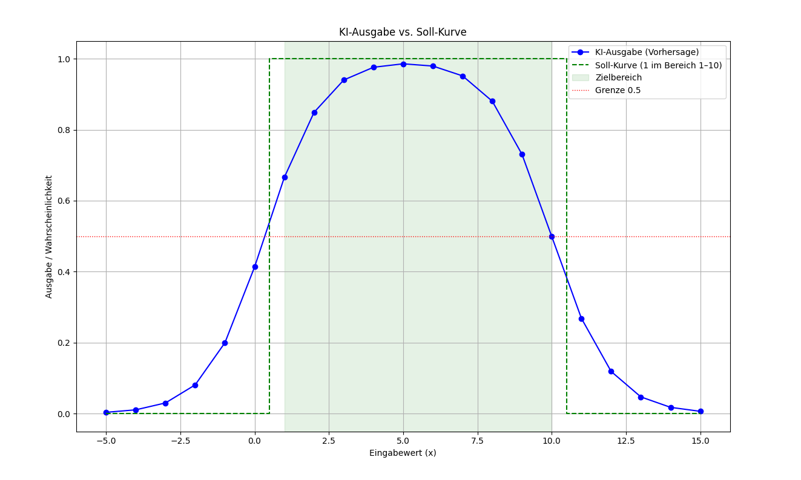

# 🧠 Einfaches Neuronales Netz in purem Python

Dieses Projekt demonstriert, wie man **ein einfaches neuronales Netz mit zwei Neuronen** und einer **Sigmoid-Aktivierungsfunktion** vollständig von Hand implementieren kann – **ohne Frameworks** wie TensorFlow oder PyTorch.  
Ziel ist es, die **Funktionsweise eines neuronalen Modells** (Vorwärtsdurchlauf, Fehlerberechnung und Backpropagation) praktisch zu verstehen.

---

## 🚀 Überblick

Das Netz wird darauf trainiert, eine einfache Funktion zu lernen:

- Ausgabe `1`, wenn der Eingabewert `x` im Bereich **1 bis 10** liegt  
- Ausgabe `0`, sonst  

Die beiden Neuronen lernen also, diesen Bereich zu „erkennen“.

Nach dem Training werden die Ergebnisse grafisch mit **matplotlib** dargestellt.

---

## ⚙️ Funktionsweise

1. **Aktivierungsfunktion:**  
   Sigmoid-Funktion  
   \[
   σ(z) = \frac{1}{1 + e^{-z}}
   \]

2. **Struktur:**  
   Zwei Neuronen (`n1` und `n2`), die gemeinsam eine einfache logische Funktion modellieren.  
   Die Ausgabe wird durch Multiplikation der beiden Neuronen berechnet:  
   \[
   y_{pred} = n1 \times n2
   \]

3. **Lernverfahren:**  
   - Quadratischer Fehler  
   - Backpropagation  
   - Stochastische Gradientenabstiegs-Methode (SGD)  
   - Sehr kleine Lernrate (`η = 0.000005`), um Stabilität zu gewährleisten

---

## 📊 Beispielausgabe

Nach dem Training gibt das Programm Vorhersagen für verschiedene `x`-Werte aus und visualisiert die Ergebnisse:



*(Beispiel: Ausgabe ≈ 1 im Bereich 1–10, sonst ≈ 0)*

---

## 💻 Verwendung

### Voraussetzungen
- Python 3.8 oder höher  
- `matplotlib`

### Ausführen
```bash
python neuronales_netz.py
